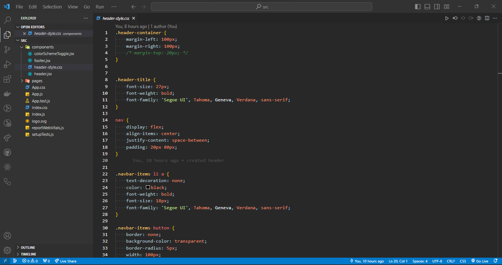

# coderDark

Enhance your coding experience with the sleek and stylish Your Theme Name for Visual Studio Code. This carefully crafted dark theme provides a comfortable and visually pleasing environment for various programming languages.
 

## Installation

1. Open **Extensions** sidebar panel in Visual Studio Code. `View → Extensions`
2. Search for `coderDark`
3. Click **Install**
4. Choose your color theme with `File → Preferences → Color Theme → Dark Plus -> Dark Grey`

## Features

- Feature 1
- Feature 2
- ...

## Screenshots

## Issues

If you find any issues or have suggestions, please [open an issue](https://github.com/MB-44/coder-dark-theme/issues).

## Contributing

Contributions are welcome! 

**Enjoy your coding with coderDark
